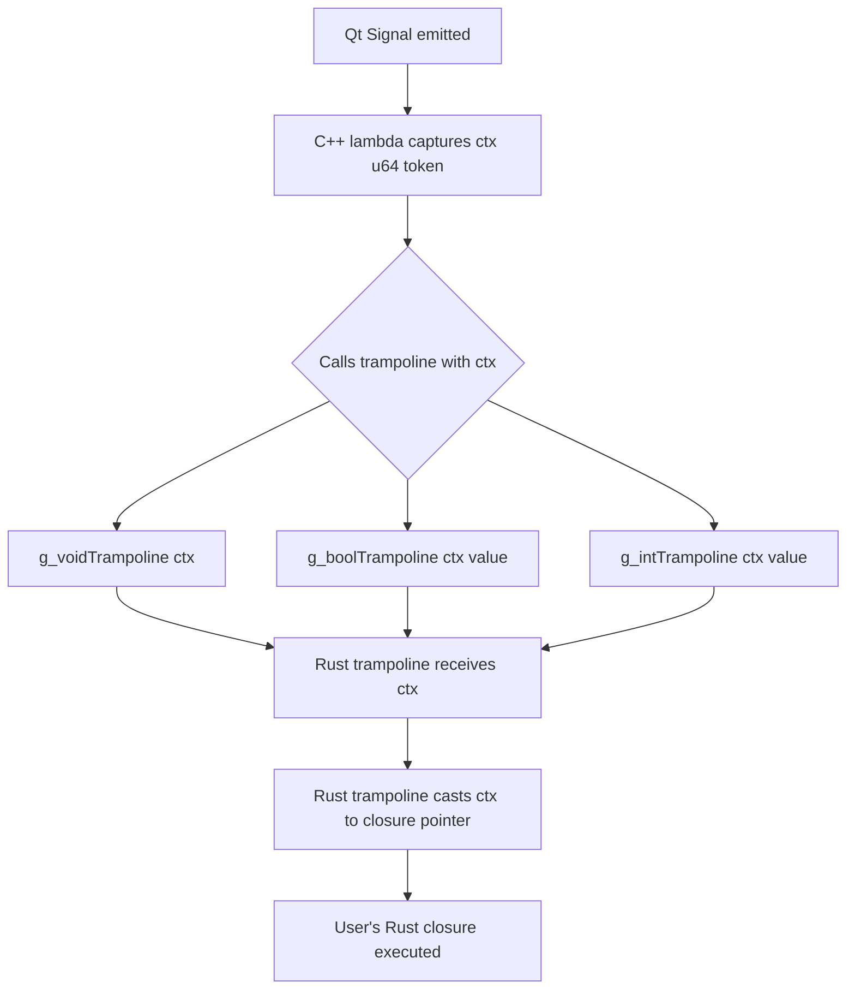

# qtrs Widget Addition Guide

## Overview

This document guides you through the **standard 5-layer process** for adding a new Qt widget to the qtrs framework.

---

## Quick Reference Checklist

| Step | File | Action |
|------|------|--------|
| 1 | `src/cpp/{widget}.h` | Create C++ inline wrapper functions |
| 2 | `src/cpp/qt_widget.h` | Add `#include "{widget}.h"` |
| 3 | `src/ffi.rs` | Add cxx bridge declarations |
| 4 | `src/{widget}.rs` | Create safe Rust wrapper + Builder + Drop |
| 5 | `src/lib.rs` | Add `pub mod {widget};` + `pub use {widget}::*;` |

---

## Layer 1: C++ Glue Code

Create `src/cpp/picture.h`:

```cpp
// src/cpp/picture.h — QLabel-based image widget
#pragma once

#include <QLabel>
#include <QPixmap>
#include <QString>
#include <string>

// Constructor
inline QLabel *Picture_new(QWidget *parent) {
    return new QLabel(parent);
}

// Setters
inline void Picture_setPixmap(QLabel *pic, const std::string &path) {
    pic->setPixmap(QPixmap(QString::fromStdString(path)));
}

inline void Picture_setPixmapScaled(QLabel *pic, const std::string &path, int w, int h) {
    QPixmap pixmap(QString::fromStdString(path));
    pic->setPixmap(pixmap.scaled(w, h, Qt::KeepAspectRatio, Qt::SmoothTransformation));
}

inline void Picture_clear(QLabel *pic) {
    pic->clear();
}

// Destructor
inline void Picture_delete(QLabel *pic) { delete pic; }
```

---

## Layer 2: Umbrella Header

Add the include to `src/cpp/qt_widget.h`:

```cpp
// src/cpp/qt_widget.h
#pragma once

// included headers
// ...
#include "picture.h"      // ADD THIS
```

---

## Layer 3: cxx Bridge (src/ffi.rs)

Add declarations inside the `unsafe extern "C++"` block:

```rust
// src/ffi.rs — add inside unsafe extern "C++" block

// Picture (QLabel-based image widget)
unsafe fn Picture_new(parent: *mut QWidget) -> *mut QLabel;
unsafe fn Picture_setPixmap(pic: *mut QLabel, path: &CxxString);
unsafe fn Picture_setPixmapScaled(pic: *mut QLabel, path: &CxxString, width: i32, height: i32);
unsafe fn Picture_clear(pic: *mut QLabel);
unsafe fn Picture_delete(pic: *mut QLabel);
```

### Upcast

The `toQWidget_QLabel` upcast already exists in `ffi.rs`. For custom widgets like `ClickableLabel`, add:

```rust
unsafe fn toQWidget_QClickableLabel(label: *mut QClickableLabel) -> *mut QWidget;
```

And in `src/cpp/layout.h`:

```cpp
inline QWidget *toQWidget_QClickableLabel(ClickableLabel *w) {
    return static_cast<QWidget *>(w);
}
```

### For Widget::find() Support

Add to `ffi.rs`:

```rust
unsafe fn QWidget_findPicture(parent: *mut QWidget, name: &CxxString) -> *mut QLabel;
```

And to `src/cpp/layout.h`:

```cpp
inline QLabel *QWidget_findPicture(QWidget *parent, const std::string &name) {
    return parent->findChild<QLabel *>(QString::fromStdString(name));
}
```

---

## Layer 4: Rust Wrapper (src/picture.rs)

Create the complete Rust wrapper:

```rust
//! Image display widget.
//!
//! Wraps QLabel to display pixmaps from image files.

use cxx::let_cxx_string;
use crate::ffi;
use crate::widget::AsWidget;

/// An image display widget.
///
/// # Example
///
/// ```no_run
/// use qtrs::Picture;
///
/// let image = Picture::new()
///     .pixmap("assets/logo.png")
///     .build();
/// ```
pub struct Picture {
    ptr: *mut ffi::QLabel,
    has_parent: bool,
}

impl Picture {
    /// Start building a new Picture widget.
    pub fn new() -> Builder {
        Builder::new()
    }

    /// Set the displayed image from a file path.
    pub fn set_pixmap(&self, path: &str) {
        debug_assert!(!self.ptr.is_null());
        let_cxx_string!(c_path = path);
        unsafe { ffi::Picture_setPixmap(self.ptr, &c_path); }
    }

    /// Set image scaled to specific dimensions.
    pub fn set_pixmap_scaled(&self, path: &str, width: i32, height: i32) {
        debug_assert!(!self.ptr.is_null());
        let_cxx_string!(c_path = path);
        unsafe { ffi::Picture_setPixmapScaled(self.ptr, &c_path, width, height); }
    }

    /// Clear the displayed image.
    pub fn clear(&self) {
        debug_assert!(!self.ptr.is_null());
        unsafe { ffi::Picture_clear(self.ptr); }
    }

    #[doc(hidden)]
    pub(crate) fn from_raw(ptr: *mut ffi::QLabel) -> Self {
        debug_assert!(!ptr.is_null());
        Self { ptr, has_parent: true }
    }
}

impl AsWidget for Picture {
    fn widget_ptr(&self) -> *mut ffi::QWidget {
        debug_assert!(!self.ptr.is_null());
        unsafe { ffi::toQWidget_QLabel(self.ptr) }
    }

    fn set_has_parent(&mut self) {
        self.has_parent = true;
    }
}

impl Drop for Picture {
    fn drop(&mut self) {
        if self.ptr.is_null() { return; }
        if !self.has_parent {
            unsafe { ffi::Picture_delete(self.ptr); }
        }
        self.ptr = std::ptr::null_mut();
    }
}

// Builder
pub struct Builder {
    pixmap: Option<String>,
    pixmap_scaled: Option<(String, i32, i32)>,
    parent: Option<*mut ffi::QWidget>,
}

impl Builder {
    fn new() -> Self {
        Self {
            pixmap: None,
            pixmap_scaled: None,
            parent: None,
        }
    }

    /// Set the image from a file path (original size).
    pub fn pixmap(mut self, path: impl Into<String>) -> Self {
        self.pixmap = Some(path.into());
        self
    }

    /// Set the image scaled to specific dimensions.
    pub fn pixmap_scaled(mut self, path: impl Into<String>, width: i32, height: i32) -> Self {
        self.pixmap_scaled = Some((path.into(), width, height));
        self
    }

    /// Set parent widget.
    pub fn parent(mut self, parent: &dyn AsWidget) -> Self {
        self.parent = Some(parent.widget_ptr());
        self
    }

    /// Build the C++ QLabel and return the Rust wrapper.
    pub fn build(self) -> Picture {
        let ptr = unsafe {
            ffi::Picture_new(self.parent.unwrap_or(std::ptr::null_mut()))
        };
        debug_assert!(!ptr.is_null());

        let pic = Picture {
            ptr,
            has_parent: self.parent.is_some(),
        };

        if let Some(path) = self.pixmap {
            pic.set_pixmap(&path);
        }
        if let Some((path, w, h)) = self.pixmap_scaled {
            pic.set_pixmap_scaled(&path, w, h);
        }

        pic
    }
}
```

---

## Layer 5: Library Exports (src/lib.rs)

Add the new widget to the public API:

```rust
// src/lib.rs

pub mod picture;
pub use picture::Picture;

// Add to prelude
pub mod prelude {
    pub use super::{
        // ...
        Picture,  // ADD THIS
    };
    
    pub use super::UiLoader;
}
```

---

## Signal Support (Full)

If your widget emits signals (e.g., `clicked`, `valueChanged`), you need:

1. Define signals in C++ (using `Q_OBJECT` macro)
2. Connect signals to Rust trampoline (using `g_voidTrampoline` / `g_boolTrampoline` / `g_intTrampoline`)
3. Expose `on_*` methods in Rust (using `signal::leak_*`)

### Complete Example: ClickableLabel

```cpp
// src/cpp/clickablelabel.h
#pragma once

#include <QLabel>
#include <QMouseEvent>
#include "signal.h"

// Define Qt subclass with signals
class ClickableLabel : public QLabel {
    Q_OBJECT
public:
    explicit ClickableLabel(QWidget *parent = nullptr) : QLabel(parent) {}

protected:
    void mousePressEvent(QMouseEvent *event) override {
        Q_UNUSED(event);
        emit clicked();              // Emit signal
        emit clicked_with_pos(event->pos().x(), event->pos().y());
    }

signals:
    void clicked();                  // Signal with no parameters
    void clicked_with_pos(int x, int y);  // Signal with parameters
};

// Constructor / Destructor
inline ClickableLabel *ClickableLabel_new(QWidget *parent) {
    return new ClickableLabel(parent);
}

inline void ClickableLabel_delete(ClickableLabel *label) {
    delete label;
}

// Setters
inline void ClickableLabel_setText(ClickableLabel *label, const std::string &text) {
    label->setText(QString::fromStdString(text));
}

inline void ClickableLabel_setPixmap(ClickableLabel *label, const std::string &path) {
    label->setPixmap(QPixmap(QString::fromStdString(path)));
}

// Signal connection (void)
inline void ClickableLabel_onClicked(ClickableLabel *label, uint64_t ctx) {
    QObject::connect(label, &ClickableLabel::clicked, [ctx]() {
        if (g_hasVoidTrampoline) {
            g_voidTrampoline(ctx);   // Call Rust closure
        }
    });
}

// Signal connection (with parameters)
inline void ClickableLabel_onClickedWithPos(ClickableLabel *label, uint64_t ctx) {
    QObject::connect(label, &ClickableLabel::clicked_with_pos, [ctx](int x, int y) {
        if (g_hasIntTrampoline) {
            g_intTrampoline(ctx, x);
        }
    });
}
```

### Signal Type Reference

| Signal Parameters | C++ Connection | Rust Leak Function | Trampoline |
|-------------------|----------------|-------------------|------------|
| None (`void`) | `g_voidTrampoline(ctx)` | `signal::leak_void(f)` | `g_hasVoidTrampoline` |
| `bool` | `g_boolTrampoline(ctx, value)` | `signal::leak_bool(f)` | `g_hasBoolTrampoline` |
| `int` / `i32` | `g_intTrampoline(ctx, value)` | `signal::leak_int(f)` | `g_hasIntTrampoline` |
| Multiple parameters | Need custom trampoline | N/A | N/A |

### FFI Bridge (src/ffi.rs)

```rust
// ClickableLabel
type QClickableLabel;

unsafe fn QClickableLabel_new(parent: *mut QWidget) -> *mut QClickableLabel;
unsafe fn QClickableLabel_setText(label: *mut QClickableLabel, text: &CxxString);
unsafe fn QClickableLabel_setPixmap(label: *mut QClickableLabel, path: &CxxString);
unsafe fn QClickableLabel_onClicked(label: *mut QClickableLabel, ctx: u64);
unsafe fn QClickableLabel_onClickedWithPos(label: *mut QClickableLabel, ctx: u64);
unsafe fn QClickableLabel_delete(label: *mut QClickableLabel);

// Upcast
unsafe fn toQWidget_QClickableLabel(label: *mut QClickableLabel) -> *mut QWidget;
```

### Rust Wrapper (src/clickablelabel.rs)

```rust
//! Clickable label widget with signal support.

use cxx::let_cxx_string;
use crate::ffi;
use crate::signal::{self, SignalHandle};
use crate::widget::AsWidget;

pub struct ClickableLabel {
    ptr: *mut ffi::QClickableLabel,
    has_parent: bool,
    signal_handles: Vec<SignalHandle>,
}

impl ClickableLabel {
    pub fn new() -> Builder { Builder::new() }

    pub fn set_text(&self, text: &str) {
        debug_assert!(!self.ptr.is_null());
        let_cxx_string!(c_text = text);
        unsafe { ffi::QClickableLabel_setText(self.ptr, &c_text); }
    }

    pub fn set_pixmap(&self, path: &str) {
        debug_assert!(!self.ptr.is_null());
        let_cxx_string!(c_path = path);
        unsafe { ffi::QClickableLabel_setPixmap(self.ptr, &c_path); }
    }

    #[doc(hidden)]
    pub(crate) fn from_raw(ptr: *mut ffi::QClickableLabel) -> Self {
        debug_assert!(!ptr.is_null());
        Self { ptr, has_parent: true, signal_handles: Vec::new() }
    }
}

impl AsWidget for ClickableLabel {
    fn widget_ptr(&self) -> *mut ffi::QWidget {
        debug_assert!(!self.ptr.is_null());
        unsafe { ffi::toQWidget_QClickableLabel(self.ptr) }
    }

    fn set_has_parent(&mut self) {
        self.has_parent = true;
    }
}

impl Drop for ClickableLabel {
    fn drop(&mut self) {
        if self.ptr.is_null() { return; }
        if self.has_parent {
            unsafe { ffi::QWidget_disconnectAll(self.ptr as *mut _); }
            for h in self.signal_handles.drain(..) {
                unsafe { h.reclaim(); }
            }
        } else {
            for h in self.signal_handles.drain(..) {
                unsafe { h.reclaim(); }
            }
            unsafe { ffi::QClickableLabel_delete(self.ptr) };
        }
        self.ptr = std::ptr::null_mut();
    }
}

// Builder
pub struct Builder {
    text: Option<String>,
    pixmap: Option<String>,
    on_clicked: Option<Box<dyn Fn()>>,
    on_clicked_with_pos: Option<Box<dyn Fn(i32)>>,
    parent: Option<*mut ffi::QWidget>,
}

impl Builder {
    fn new() -> Self {
        Self {
            text: None,
            pixmap: None,
            on_clicked: None,
            on_clicked_with_pos: None,
            parent: None,
        }
    }

    pub fn text(mut self, text: impl Into<String>) -> Self {
        self.text = Some(text.into());
        self
    }

    pub fn pixmap(mut self, path: impl Into<String>) -> Self {
        self.pixmap = Some(path.into());
        self
    }

    /// Callback when the label is clicked.
    pub fn on_clicked<F: Fn() + 'static>(mut self, f: F) -> Self {
        self.on_clicked = Some(Box::new(f));
        self
    }

    /// Callback when clicked with position (x coordinate).
    pub fn on_clicked_with_pos<F: Fn(i32) + 'static>(mut self, f: F) -> Self {
        self.on_clicked_with_pos = Some(Box::new(f));
        self
    }

    pub fn parent(mut self, parent: &dyn AsWidget) -> Self {
        self.parent = Some(parent.widget_ptr());
        self
    }

    pub fn build(self) -> ClickableLabel {
        let ptr = unsafe {
            ffi::QClickableLabel_new(self.parent.unwrap_or(std::ptr::null_mut()))
        };
        debug_assert!(!ptr.is_null());

        let mut label = ClickableLabel {
            ptr,
            has_parent: self.parent.is_some(),
            signal_handles: Vec::new(),
        };

        if let Some(ref text) = self.text {
            label.set_text(text);
        }

        if let Some(ref path) = self.pixmap {
            label.set_pixmap(path);
        }

        if let Some(cb) = self.on_clicked {
            let handle = signal::leak_void(cb);
            unsafe { ffi::QClickableLabel_onClicked(ptr, handle.token); }
            label.signal_handles.push(handle);
        }

        if let Some(cb) = self.on_clicked_with_pos {
            let handle = signal::leak_int(cb);
            unsafe { ffi::QClickableLabel_onClickedWithPos(ptr, handle.token); }
            label.signal_handles.push(handle);
        }

        label
    }
}
```

### Signal Connection Flow



### Signal Types Reference

| Signal Type | C++ Connection Function | Rust Leak Helper | Trampoline Check |
|-------------|------------------------|------------------|------------------|
| `void()` | `g_voidTrampoline(ctx)` | `signal::leak_void(f)` | `g_hasVoidTrampoline` |
| `bool` | `g_boolTrampoline(ctx, value)` | `signal::leak_bool(f)` | `g_hasBoolTrampoline` |
| `int` / `i32` | `g_intTrampoline(ctx, value)` | `signal::leak_int(f)` | `g_hasIntTrampoline` |

### Key Points for Signal Implementation

1. `Q_OBJECT` macro is required for signals to work
2. Signal connections are made using `QObject::connect` with lambda capturing `ctx`
3. `g_has*Trampoline` checks ensure trampoline is registered
4. `signal::leak_*` stores the Rust closure and returns a `u64` token
5. `SignalHandle` manages the closure lifetime (reclaims on Drop)
6. `has_parent` logic determines whether closures are reclaimed or leaked

### Multiple Parameters

Currently, the trampoline system supports single-parameter signals. For multiple parameters, you need to:

1. Create a new trampoline in `signal.rs`
2. Add a new `SignalKind` variant
3. Add a new `leak_*` function
4. Add a new C++ trampoline function

See `src/signal.rs` for existing implementations.

---

## Adding Widget::find() Support (Optional)

To enable runtime widget lookup by `objectName`:

### 1. Update WidgetKind enum (src/widget.rs)

```rust
pub enum WidgetKind {
    // ...
    Picture,   // ADD
    Any,
}
```

### 2. Update FoundWidget enum (src/widget.rs)

```rust
pub enum FoundWidget {
    // ...
    Picture(crate::Picture),   // ADD
}
```

### 3. Add match arm in Widget::find() (src/widget.rs)

```rust
WidgetKind::Picture => {
    let ptr = unsafe { ffi::QWidget_findPicture(self.ptr, &c_name) };
    if ptr.is_null() { None }
    else { Some(FoundWidget::Picture(crate::Picture::from_raw(ptr))) }
}
```

---

## Update build.rs

Add the new header to the rerun list:

```rust
for name in &[
    // ...
    "picture",  // ADD THIS
] {
    println!("cargo:rerun-if-changed=src/cpp/{}.h", name);
}
```

---

## Complete Usage Example

```rust
use qtrs::prelude::*;

fn main() {
    let app = Application::new();

    let window = Widget::new()
        .title("Image Viewer")
        .size(800, 600)
        .show();

    let mut layout = VBoxLayout::with_parent(&window);

    let logo = Picture::new()
        .pixmap_scaled("assets/logo.png", 400, 300)
        .build();

    let label = Label::new("Hello, qtrs!").build();

    layout.add_widget(Box::new(logo));
    layout.add_widget(Box::new(label));

    window.set_vlayout(layout.layout_ptr());

    app.exec();
}
```

---

## Troubleshooting

| Error | Likely Cause | Fix |
|-------|--------------|-----|
| `unknown type 'QLabel'` | Missing include in C++ header | Add `#include <QLabel>` |
| `cannot find function` | Header not included in `qt_widget.h` | Add `#include "{widget}.h"` |
| `undefined reference` | C++ function signature mismatch | Check FFI matches C++ exactly |
| `debug_assert!(!self.ptr.is_null())` | Widget not constructed | Check `*_new` returns non-null |
| Signal not firing | Trampoline not registered | Ensure `ensure_trampolines_registered()` is called |
| `g_*Trampoline` undefined | Missing `#include "signal.h"` | Add `#include "signal.h"` to C++ header |
| Closure not called on Drop | `has_parent` logic wrong | Check `has_parent` is set correctly |

---

## Document Version

- **Version:** 2.0
- **Qt Version:** 6.2+
- **Rust MSRV:** 1.70+
- **Last Updated:** 2026-07-09