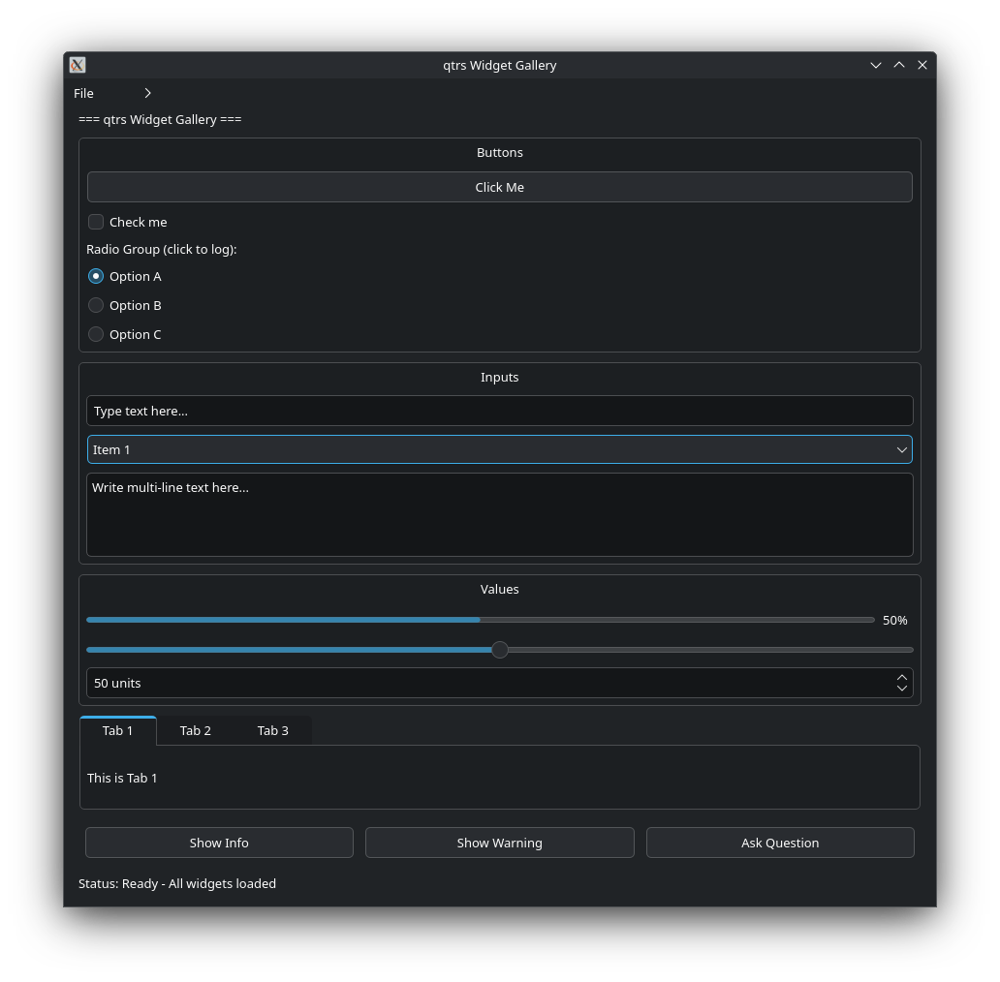

# qtrs — Rust-style Qt6 bindings

[](https://crates.io/crates/qtrs)
[](https://docs.rs/qtrs)
[](LICENSE)



A type-safe, builder-pattern-driven Qt6 GUI library for Rust. Built on
[`cxx`](https://cxx.rs) for zero-cost C++ interop, with RAII memory
management and signal/callback bridging.

## Features

- Builder pattern — chain `.title("X").size(800, 600).show()`
- RAII cleanup — automatic C++ deletion, parent-child aware (no double-free)
- Signal bridging — Qt signals invoke Rust closures via a global trampoline
- Layout ownership — adding a widget to a layout transfers ownership
- .ui file loading — load Qt Designer `.ui` files at runtime (`feature = "ui"`)
- Zero unsafe in public API — all FFI is encapsulated

## Quick Start

```rust
use qtrs::prelude::*;

fn main() {
    let app = Application::new();

    let mut window = Widget::new()
        .title("Hello, qtrs!")
        .size(400, 300)
        .build();

    let mut layout = VBoxLayout::with_parent(&window);

    let btn = PushButton::new("Click me")
        .on_clicked(|| println!("clicked!"))
        .build();
    let label = Label::new("Welcome!").build();

    layout.add_widget(Box::new(btn));
    layout.add_widget(Box::new(label));

    window.set_vlayout(layout.layout_ptr());
    window.show();

    app.exec();
}
```

## Widgets

| Type | Qt Class | Signals |
|------|----------|---------|
| `Application` | `QApplication` | — |
| `Widget` | `QWidget` | — |
| `PushButton` | `QPushButton` | `on_clicked` |
| `Label` | `QLabel` | — |
| `LineEdit` | `QLineEdit` | `on_return_pressed` |
| `CheckBox` | `QCheckBox` | `on_toggled(bool)` |
| `RadioButton` | `QRadioButton` | `on_toggled(bool)` |
| `ComboBox` | `QComboBox` | `on_current_text_changed`<br>`on_current_index_changed(i32)` |
| `TextEdit` | `QTextEdit` | `on_text_changed` |
| `Slider` | `QSlider` | `on_value_changed(i32)` |
| `SpinBox` | `QSpinBox` | `on_value_changed(i32)` |
| `ProgressBar` | `QProgressBar` | — |
| `GroupBox` | `QGroupBox` | — |
| `TabWidget` | `QTabWidget` | `on_current_changed(i32)` |
| `Menu` | `QMenu` | — |
| `MenuBar` | `QMenuBar` | — |
| `Timer` | `QTimer` | `on_timeout`<br>`single_shot(ms, fn)` |
| `VBoxLayout` | `QVBoxLayout` | — |
| `HBoxLayout` | `QHBoxLayout` | — |
| `GridLayout` | `QGridLayout` | — |

---

This matches the current codebase. Remove `Status` column as requested.

## Prerequisites

Qt6 with development headers:

| Platform | Instructions |
|---|---|
| Debian / Ubuntu | `sudo apt install qt6-base-dev qt6-declarative-dev` |
| Fedora | `sudo dnf install qt6-qtbase-devel qt6-qtdeclarative-devel` |
| Arch | `sudo pacman -S qt6-base qt6-declarative` |
| macOS (Homebrew) | `brew install qt@6` |
| Windows | Install from [qt.io](https://www.qt.io/download-open-source) or via [vcpkg](https://vcpkg.io) |

### macOS notes

After installing via Homebrew, tell `pkg-config` where to find Qt:

```sh
export PKG_CONFIG_PATH="$(brew --prefix qt@6)/lib/pkgconfig:$PKG_CONFIG_PATH"
```

Add this to your `~/.zshrc` or `~/.bashrc` for persistence.

### Windows notes

The build script uses `pkg-config` to locate Qt. When using **vcpkg**,
set the environment variable:

```powershell
$env:PKG_CONFIG_PATH = "$env:VCPKG_ROOT\installed\x64-windows\lib\pkgconfig"
```

When using the **official Qt installer**, set `CMAKE_PREFIX_PATH` and
ensure `qmake6` is on your `PATH`.

```powershell
$env:CMAKE_PREFIX_PATH = "C:\Qt\6.8.2\msvc2022_64"
$env:PATH += ";C:\Qt\6.8.2\msvc2022_64\bin"
```

A Microsoft Visual Studio build toolchain (MSVC) is required on Windows.

## Installation

Add to your `Cargo.toml`:

```toml
[dependencies]
qtrs = "0.1.0"
```
Enable .ui file loading:

```toml
[dependencies]
qtrs = { version = "0.1.0", features = ["ui"] }
```

## Memory management

Widgets are deleted automatically on `Drop` — unless they have a Qt
parent (set explicitly or via layout). In that case Qt's parent-child tree
handles deletion, preventing double-free.

```
Widget created without parent  ->  Drop deletes C++ object
Widget created with parent     ->  Drop skips deletion (Qt handles it)
Widget added to layout         ->  Layout takes ownership, Drop skips deletion
```

## Thread safety

Qt GUI classes are **not thread-safe**. All widget creation, mutation, and
the event loop must happen on the main thread.

## License

MIT OR Apache-2.0 — see [LICENSE-MIT](LICENSE-MIT) and [LICENSE-APACHE](LICENSE-APACHE).
